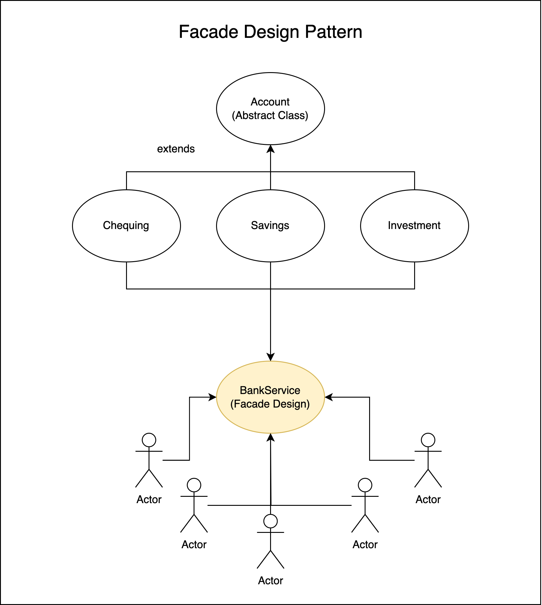
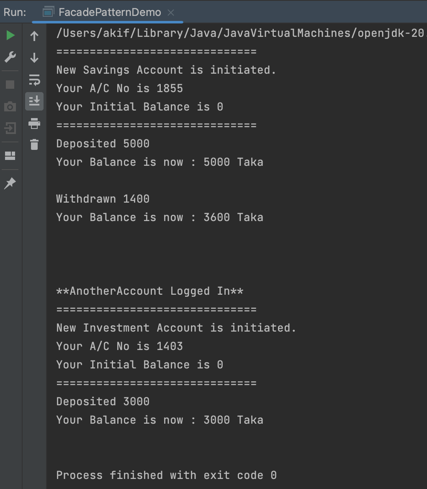

# A demonstration of Facade Design Pattern

# Course Title : Object Oriented Design and Design Patterns Lab(CSE 4122)
## Author
Akif Islam<br>
Department of CSE, University of Rajshahi<br>
iamakifislam@gmail.com<br><br><br>

## Experiment 03
<p>Write a Java program that demonstrate the
implementation of a facade design pattern for a Banking Service
with Cheaquing, Saving, and Investment modules.</p>

## Story of the Program
<p>
The Facade pattern is a structural design pattern that provides a simplified interface to a complex subsystem, making it easier to use.
</p>

## Class Diagram




## How to Run?
```bash
  $javac FacadePatternDemo.java
  $java FacadePatternDemo
```


## Facade Pattern Demo Program
```java
// Creating My Bank Account, Deposit 5000, Withdraw 1400
BankService myBankService = new BankService();
myBankService.createAccount("Savings");
myBankService.deposit(5000);
myBankService.checkBalance();

myBankService.withdraw(1400);
myBankService.checkBalance();

// Transfer Money from My Account to Another Account
System.out.println("\n\n**AnotherAccount Logged In**");
BankService anotherBankService = new BankService();
anotherBankService.createAccount("Investment");
myBankService.transfer(anotherBankService,3000);
anotherBankService.checkBalance();

```

## Output



